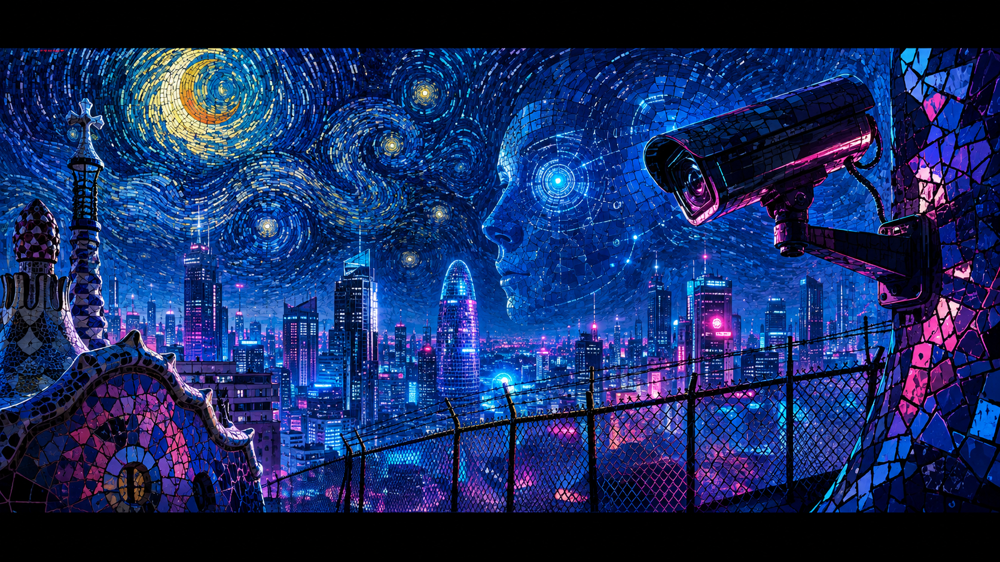

<div align="center">



# 🛡️ SUPERGUARD — AI Perimeter & Anti-Theft Surveillance

**Protección inteligente contra robos, en tiempo real y 100% local.**

Persona sospechosa en la zona protegida → detección por IA → foto a Telegram →
**foco + sirena** vía WiFi. Sin nube, sin suscripción obligatoria, sin falsas alarmas.

```
ES · EN · RU
```

---

## 🎯 El problema

> Los robos de **cable** (telecom, eléctrico, obra) y las **intrusiones de perímetro**
> son una plaga en España y Europa. Los ladrones operan rápido, de noche,
> y las cámaras pasivas solo graban el delito — no lo evitan.

**SuperGuard no graba el robo: lo impide.**

---

## ⚡ Qué hace

| Señal | Detección |
|---|---|
| 🧍 Persona en zona prohibida | YOLO + confirmación en N fotogramas (anti-falsas) |
| 🪛 Ladrón disfrazado de electricista | **Pértiga aislante (УКН)** + casco + chaleco — análisis de FORMA, funciona de noche |
| 🚧 Intrusión de perímetro | Persona cruzando el límite → alarma inmediata |
| 🔦 Reacción física | Foco + sirena vía WiFi (ESP32) — el ladrón huye |
| 📲 Notificación | Foto + texto a Telegram en < 3 segundos |

---

## 🏗️ Arquitectura

```
[Cámaras IP (RTSP)] → [IA local: YOLO + detector de pértiga] → [confirmación]
        → [Telegram: foto + texto] + [ESP32: foco + sirena]
```

```
        ┌────────────────────────────────────────────────┐
        │              SUPERGUAARD NODE                  │
        │                                                │
        │  RTSP ──▶ YOLO ──▶ detector ──▶ confirmación   │
        │   (cam)    (IA)     (perímetro)   (2 frames)   │
        │                                   │            │
        │        ┌──────────────────────────┤            │
        │        ▼                          ▼            │
        │  ┌───────────┐            ┌──────────────┐     │
        │  │ Telegram  │            │ ESP32: foco  │     │
        │  │ foto+texto│            │ + sirena     │     │
        │  └───────────┘            └──────────────┘     │
        └────────────────────────────────────────────────┘
```

**100% local**: las imágenes nunca salen de tu red. IA en el propio Mini-PC.

---

## 📦 Instalación (un script)

**Windows (PowerShell):**
```powershell
curl.exe -L https://raw.githubusercontent.com/PerfectFriend/AISuperGuard/main/install.ps1 -o install.ps1
powershell -ExecutionPolicy Bypass -File install.ps1
```

**Linux/macOS:**
```bash
curl -sSL https://raw.githubusercontent.com/PerfectFriend/AISuperGuard/main/install.sh | bash
```

Después:
```bash
python scripts/scan_cameras.py                       # encontrar la cámara
# editar config.yaml: RTSP + Telegram chat_id
python demo_prototype.py --source rtsp://user:pass@IP:554/stream1
```

---

## 🧪 Demo (sin cámara)

```bash
python demo_prototype.py --source synth --direct
```

Genera un "ladrón-electricista" sintético (casco + chaleco + pértiga hacia el cable)
y ejecuta el ciclo completo: detección → Telegram → actuador.

---

## 🔌 Actuador ESP32 (foco + sirena)

```
GPIO2 → relé 1 → FOCO
GPIO4 → relé 2 → SIRENA
```

Firmware: `docs/esp32_alarm.ino` (Arduino IDE). El sistema llama a `http://<ip>/on` y `/off`.

---

## 🗂️ Estructura

```
├── demo_prototype.py        # ciclo completo (cámara → alerta → Telegram → ESP32)
├── electrician_detector.py  # detector "ladrón-electricista" (pértiga + casco + chaleco)
├── actuator.py              # actuador WiFi: ESP32 / webhook / simulación
├── surveillance.py          # núcleo multi-cámara (RTSP → zonas → alertas)
├── scripts/scan_cameras.py  # escáner de cámaras IP
├── tools/rtsp_preview.py    # vista previa del stream
├── assets/                  # banners y medios
└── docs/                    # CAMERA-SETUP.md, esp32_alarm.ino
```

---

## 📄 Licencia

MIT — libre para usar, modificar y vender. El código es tuyo.

---

<div align="center">


**Protege tu infraestructura. 24/7. Local. Inteligente.**

</div>
